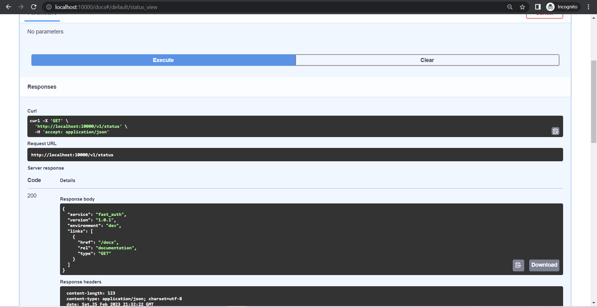

# FastAuth :lock:


FastAuth is a microservice designed to authenticate and authorize users through FastAPI, PostgreSQL, SQLAlchemy, and Docker. By utilizing modern standards like JWT (JSON Web Tokens) and CSRF (Cross-Site Request Forgery) tokens, FastAuth aims to secure accounts from common cyber threats such as token theft.

## :building_construction: Architecture

FastAuth leverages an architecture composed of Python, FastAPI, PostgreSQL, and Docker, with a significant emphasis on FastAPI middleware for authenticating JWT and CSRF tokens before accessing actual endpoints. This design ensures a secure and efficient authentication and authorization process.

## :gear: Technologies

- **FastAPI**: A modern, fast web framework for building APIs with Python 3.7+, based on standard Python type hints.
- **SQLAlchemy**: The Python SQL toolkit and Object Relational Mapper that provides application developers with the full power and flexibility of SQL.
- **PostgreSQL**: An object-relational database management system, known for its reliability and data integrity.
- **Docker**: A platform for developing, deploying, and running applications with containers, which are portable, lightweight, and stackable.

## :page_with_curl: Project Description

FastAuth is a microservice focused on user authentication and authorization. It uses a POST request for user registration, login, and authentication, assigning JWT and CSRF tokens to authorize users to access their details. The project utilizes FastAPI for the web framework, PostgreSQL for the database, SQLAlchemy for ORM, and Docker for containerization.

## :page_with_curl: Getting Started

To get FastAuth running on your local machine, follow these steps:


### :ballot_box_with_check: Prerequisites

Before you begin, ensure you have installed:

- [Docker](https://www.docker.com/products/docker-desktop)
- [Git](https://git-scm.com/downloads)

#### Step 1: Clone the Repository

Clone the WikiFetch repository to your local machine:

```bash
git clone https://github.com/RamishUrRehman007/FastAuth.git
```

#### Step 2: Setup Database and Application

Run the following Docker Build commands to setup database and application

```bash
docker-compose up -d postgres
docker-compose exec postgres sh -c '/mnt/migration.sh -d fast_auth'
docker-compose up
```


### :computer: Accessing the Application

Now, access to "http://localhost:10000/" on your browser to open swagger docs and test status endpoint.<br>



Lets perform operations using Swagger or Thunder Client!

> Register User<br>


> User Authentication<br>


> Fetching User and Authorization<br>
